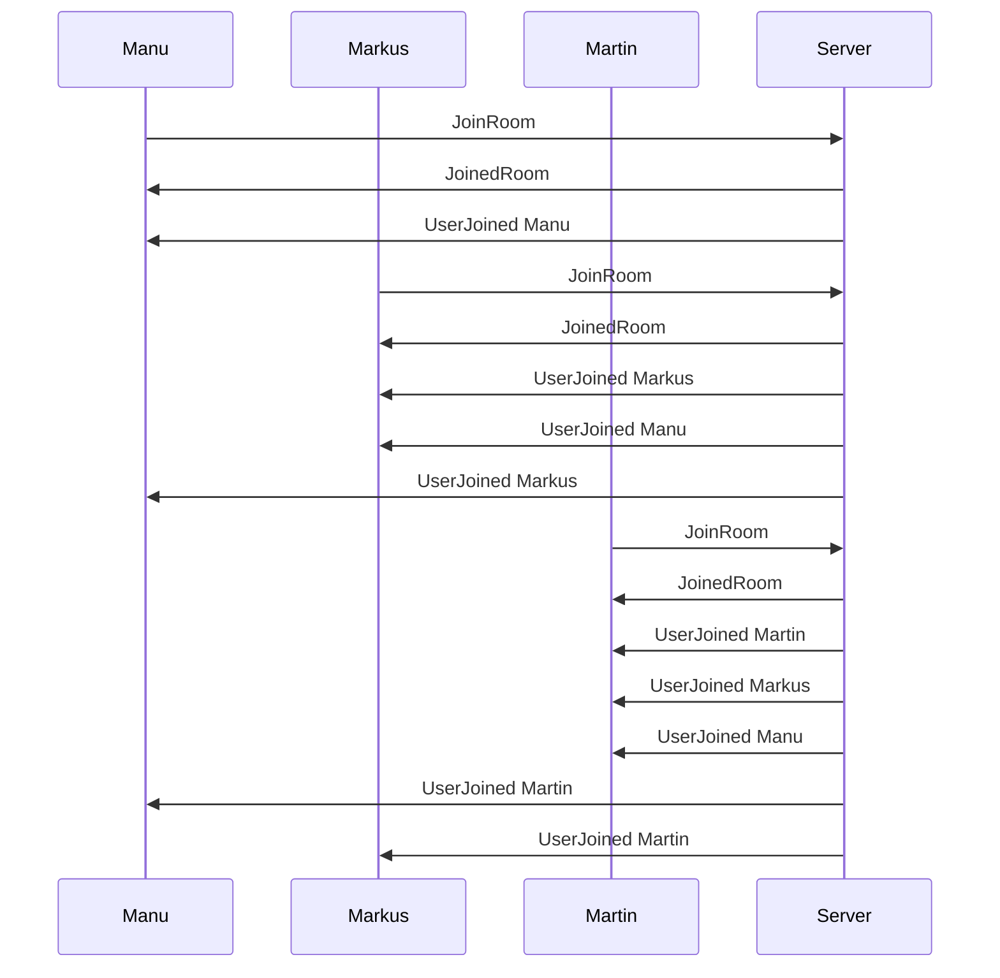
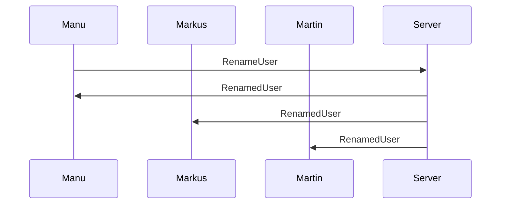

# Web Communication
## Join Room

```mermaid
sequenceDiagram
    participant Manu
    participant Markus
    participant Martin
    participant Server
    Manu->>Server: JoinRoom
    Server->>Manu: JoinedRoom
    Server->>Manu: UserJoined Manu
    Markus ->>Server: JoinRoom
    Server->>Markus: JoinedRoom
    Server->>Markus: UserJoined Markus
    Server->>Markus: UserJoined Manu
    Server->>Manu: UserJoined Markus
    Martin->>Server: JoinRoom
    Server->>Martin: JoinedRoom
    Server->>Martin: UserJoined Martin
    Server->>Martin: UserJoined Markus
    Server->>Martin: UserJoined Manu
    Server->>Manu: UserJoined Martin
    Server->>Markus: UserJoined Martin


```

## Rename User

```mermaid
sequenceDiagram
    participant Manu
    participant Markus
    participant Martin
    participant Server
    Manu->>Server: RenameUser
    Server->>Manu: RenamedUser
    Server->>Markus: RenamedUser
    Server->>Martin: RenamedUser

```

